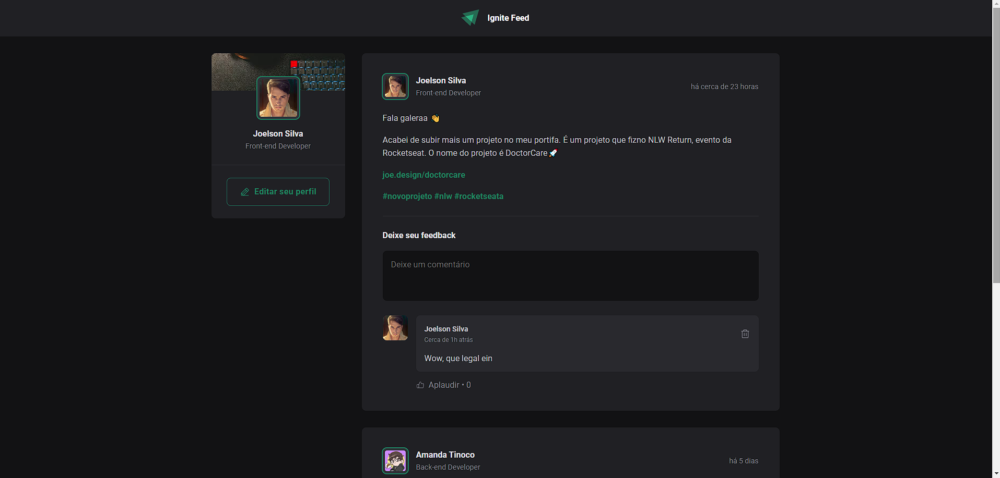
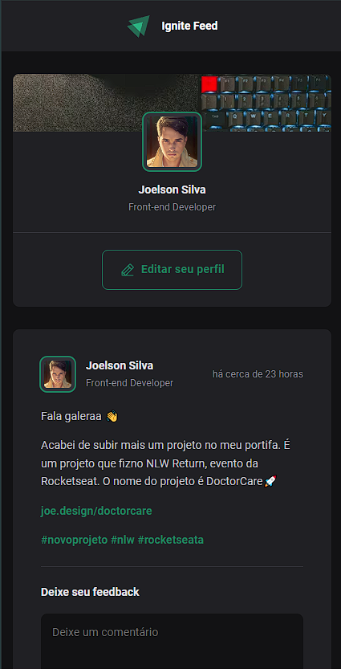

# Sobre

<h1 aling="center">Estudo em Reactjs pela Rockteseat</h1

<p>Desenvolver uma aplicação web de uma rede social</p>

# Desktop

<p aling="center">
    
  
</p>

# Mobile

<p aling="center">
  
</p>

## 🧪 Technologies

Este Projeto foi desenvolvido usando seguintes tecnolias:

- [ReactJS](https://reactjs.org)
- [Vite](https://vitejs.dev/)
- [phosphor icon](https://phosphoricons.com/)
- [date-fns](https://date-fns.org/)

## 🚀 Getting started

Clone o projeto pare ter acessos dos arquivos.

```bash
git clone

cd estudo-igniteFeed
```

Execute este comando para instalar as dependências.

```bash
npm install

npm run dev

```

## 🔖 Layout

Você pode visualiza os projetos pelos links abaixo:

- [Live Preview]()
